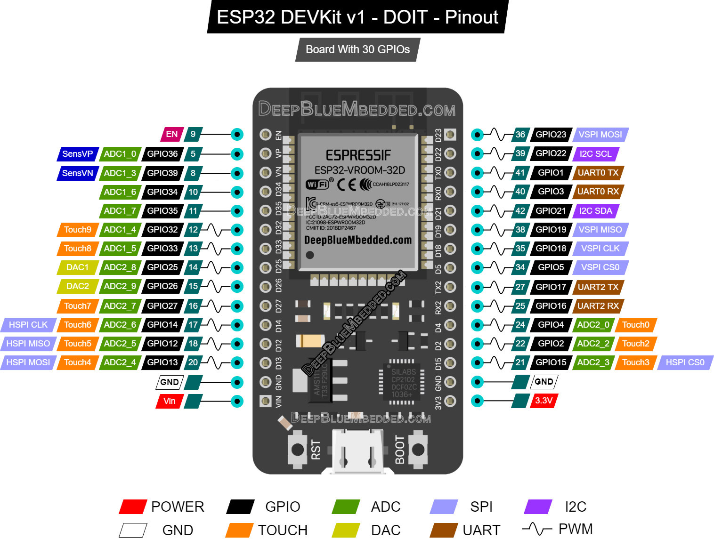

# WOL ESP32 Button Clicker

This devices takes in a WOL magic packet and presses a button with a servo.

## Hardware

- ESP32 Dev Board
  - amazon link: [https://a.co/d/bkyxUOU](https://a.co/d/bkyxUOU)
- SG90 Servo Motor
  - amazon link: [https://a.co/d/c361yn1](https://a.co/d/c361yn1)
- micro usb cable
  - amazon link : [https://a.co/d/6XSSMR3](https://a.co/d/6XSSMR3)
- 2.1 amp 5v power supply
  - amazon link: [https://a.co/d/cU4AIMH](https://a.co/d/cU4AIMH)
- 2.54mm dupont connector wire kit
  - amazon link: [https://a.co/d/bBO8pr8](https://a.co/d/bBO8pr8)
- crimping tool (optinal if you don't want the kit)
  - amazon link: [https://a.co/d/dwleWM0](https://a.co/d/dwleWM0)
- 100 pair 2.54mm male and female pin connectors (optional if you don't want the kit)
  - amazon link: [https://a.co/d/iSG2dJZ](https://a.co/d/iSG2dJZ)
- 500 pack 1 pin header housing (optional if you don't want the kit)
  - amazon link: [https://a.co/d/4uTo1Xi](https://a.co/d/4uTo1Xi)
- 28 awg 25ft wire (optional if you don't want the kit)
  - amazon link: [https://a.co/d/0cjurkq](https://a.co/d/0cjurkq)

## 3d printed housing

- [Maker world ESP32 Development Case](https://makerworld.com/en/models/692863-esp32-development-case-wire-passthrough)
- above is saved in the `3d prints` folder as well

## Setup

Below is a cleaner, step-based version of your setup instructions. I kept the technical details intact but made the flow easier to follow and added an optional “Notes” section at the end.

---

### Hardware Setup

1. **Place the ESP32 board into the 3D-printed case**
   The board is designed to fit inside the printed enclosure.

2. **Prepare the servo connector**

   - The servo’s original 3-pin connector is separated into **individual Dupont wires** so it can fit through the openings in the printed case.

3. **Connect the servo wires to the ESP32**
   Use the following pin connections:

   - **Red → VIN (5V)**
   - **Black → GND**
   - **Yellow → D13 (PWM signal pin)**

4. **Verify the ESP32 pinout**
   Reference this pinout to confirm pin positions:
   

---

### Power Details

5. **Powering the system**

   - The project uses a **5V power supply rated at 2.1A**.
   - This is sufficient to power **both the ESP32 and the servo** through VIN without issues.
   - The servo shares ground with the ESP32, and the signal line on **D13** provides PWM control.

---

### Initial Configuration

6. **Connect the ESP32 to your computer**

   - Use USB to power the board and open the **Serial Monitor**.

7. **Set required settings via Serial**
   You can configure:

   - WiFi SSID and password
   - MAC address (if needed)
   - Static IP configuration
   - Custom parameters (servo angle, timing, etc.)

---

### Web Interface

8. **Connect the ESP32 to WiFi**

   - After successful connection, the ESP32 prints its **IP address** in the Serial Monitor.

9. **Access the built-in web server**

   - Visit the printed IP address in your browser.
   - From here, you can modify all settings without needing Serial access again.

---

### Operation

10. **Send the magic packet**

    - Use any Wake-on-LAN or magic-packet sender tool.
    - Send the packet to the ESP32’s configured address.
    - The ESP32 triggers the servo to physically press the button.

---

### Notes

- **D13** is PWM-capable and works well for servo control on most ESP32 dev boards.
- Ensure the **servo does not draw excessive current**; while 2.1A is normally safe, high-load servos may require separate power.
- If the web interface becomes unreachable, you can always **reset WiFi settings via Serial** by reflashing or implementing a reset routine.
- Keep wire lengths short inside the enclosure to reduce noise on the signal line.

---

If you'd like, I can also format this in proper Markdown for your README or generate a more diagram-focused version.
